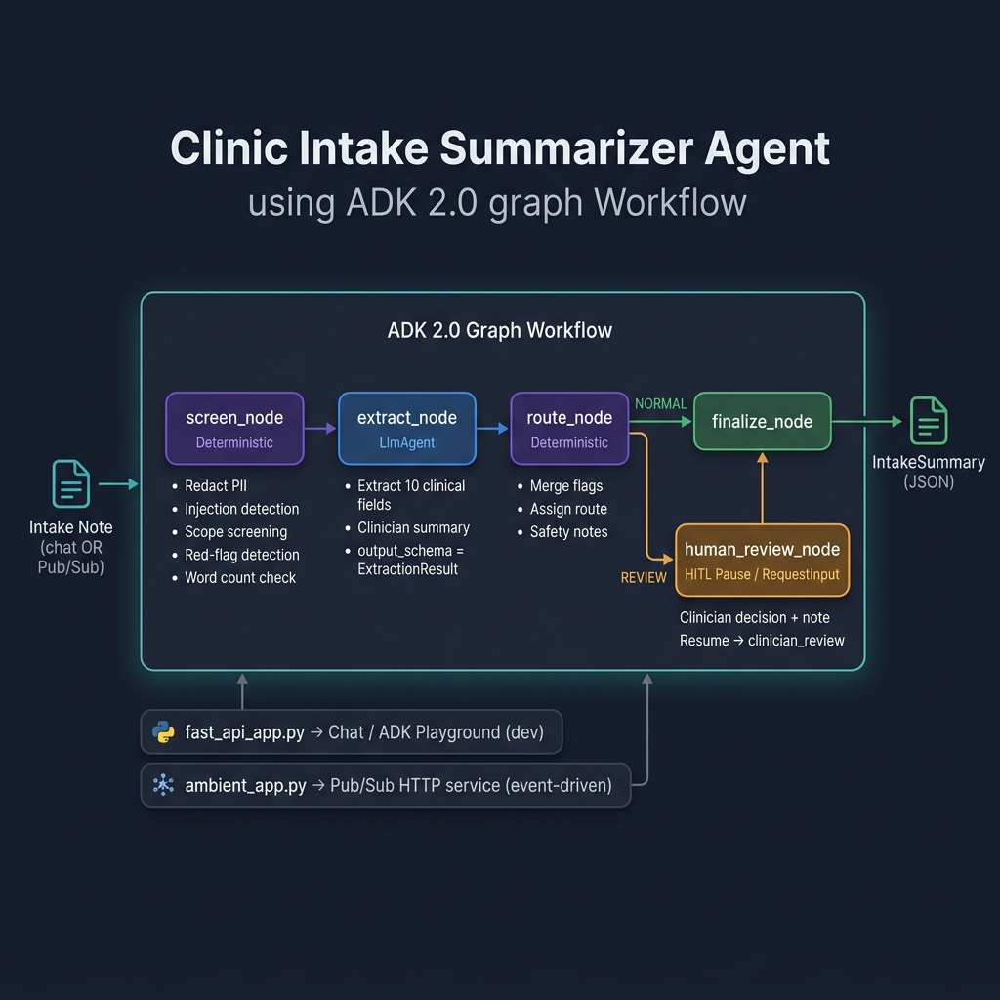

# 🏥 Clinic Intake Summarizer Agent



**AI-powered clinical intake note summarizer** — structured summaries with safety guardrails, PII redaction, and human-in-the-loop review.


-34A853?style=for-the-badge&logo=key&logoColor=white)

---

## 📋 Overview

A healthcare-focused AI agent that helps clinic staff quickly understand a patient's free-text intake note **before** consultation. It converts messy patient descriptions into a structured, clinician-facing summary — with PII redaction, prompt-injection and scope screening, red-flag routing, and human-in-the-loop review.

> [!CAUTION]
> **⚕️ Not a medical device.** This agent does **not** diagnose, prescribe, recommend dosage, or tell patients to start/stop treatment. It is an administrative + clinical-preparation assistant only; a clinician must review every case.

> [!NOTE]
> **🧪 Synthetic data only.** All sample intake notes in this repo are fabricated for demonstration. No real patient data is used.

### Key specs

| | Detail |
|---|---|
| **Demo model** | `gemini-2.5-flash-lite` (via `GEMINI_MODEL` in `.env`) |
| **Framework** | Google ADK 2.0 graph **Workflow** API |
| **Local mode** | Google AI Studio **API key** — no GCP credentials required |
| **Fallback** | If `GEMINI_MODEL` is unset, `app/agent.py` falls back to `gemini-2.5-flash-lite` |

> The model is never changed automatically at runtime.

---

## 🏗️ Architecture


Two entrypoints share the **same** workflow:

| Entrypoint | Description |
|---|---|
| `app/fast_api_app.py` | Chat / ADK Playground (dev) |
| `app/ambient_app.py` | Ambient Pub/Sub-style HTTP service (event-driven) |

### Workflow nodes — `app/agent.py`

| Node | Type | Responsibility |
|:-----|:-----|:---------------|
| **`screen_node`** | Function (deterministic) | Redact PII (regex), detect prompt injection, out-of-scope requests, red flags with basic negation handling, and word-count for insufficiency. Passes **only redacted text** downstream. |
| **`extract_node`** | `LlmAgent` (`output_schema=ExtractionResult`) | Extract clinical fields + `clinician_summary` **only**. Runs `single_turn` so it sees only the redacted text, never the raw note. Does **not** decide routing. |
| **`route_node`** | Function (deterministic) | Assemble `IntakeSummary`, merge model-proposed and deterministic red flags, run the insufficiency heuristic, and assign the final `routing_decision`. |
| **`human_review_node`** | Function + `RequestInput` (HITL) | For review cases: pause and request a clinician decision/note; attach to output on resume. |
| **`finalize_node`** | Function | Emit the final structured JSON. |

> The final routing assignment is performed in deterministic code inside `route_node`; the model never emits a `routing_decision`. The decision uses both deterministic screening signals and structured extraction fields produced by the model. Any prompt injection, out-of-scope request, merged red flag, or insufficient intake forces `HUMAN_REVIEW_REQUIRED`; otherwise the result is `NORMAL_INTAKE`.

---

## 🛡️ Safety Guardrails

| Guardrail | Description |
|:----------|:------------|
| **PII redaction** | _(deterministic, pre-model)_ — Phone, email, address, patient ID → `[REDACTED_*]`. The model never sees raw PII. |
| **Prompt-injection screening** | _(deterministic)_ — "ignore previous instructions", "bypass safety rules", etc. are flagged; embedded instructions are treated as untrusted data and ignored. |
| **Out-of-scope screening** | _(deterministic)_ — Software coding/task requests are routed for human review instead of being treated as normal clinical intake. |
| **Red-flag routing** | Chest pain, severe shortness of breath, sudden weakness, loss of consciousness, severe bleeding, severe allergic reaction, suicidal intent → human review. Explicit negation and resolved-history phrases are excluded by a small deterministic context check. |
| **Insufficient-information heuristic** | Missing chief complaint / no symptoms / too-short note / missing key context → human review. Some of these checks use the model's structured extraction. |
| **Output restrictions** | No raw PII logging; structured output only; no diagnosis / prescription / dosage advice. The model cannot directly set `routing_decision`. |

---

## 🧑‍⚕️ Human-in-the-Loop (HITL)

Review cases pause at `RequestInput`. The clinician supplies a decision and a note, which is attached to the final JSON as `clinician_review`.

| Decision | Meaning |
|:---------|:--------|
| `APPROVED` | Clinician approves the summary as-is |
| `ESCALATE` | Escalate to a specialist or higher level of care |
| `NEEDS_MORE_INFO` | Request additional patient information |

> **In v1 the model is not called again after review.** Resume interactively in the Playground, or via the ambient endpoint `POST /human-review/{session_id}`.

---

## ⚙️ Setup

### 1. Install dependencies

```bash
uvx google-agents-cli setup     # one-time: installs agents-cli + ADK skills
agents-cli install              # install project dependencies (uv sync)
```

### 2. Configure environment

Create `.env` (Google AI Studio API key mode — no GCP needed):

```ini
GOOGLE_GENAI_USE_VERTEXAI=FALSE
GOOGLE_API_KEY=<your AI Studio key>   # https://aistudio.google.com/apikey
GEMINI_MODEL=gemini-2.5-flash-lite
```

> See `.env.example` for a full template.

---

## 🚀 How to Run

### 🧪 Tests (deterministic, no model needed)

```bash
uv run pytest tests/unit -q                 # tests  (make test)
uv run --extra lint ruff check app tests    # lint   (make lint)
```

### 📊 Local eval harness (uses the model via API key)

```bash
uv run python tests/eval/run_local_eval.py
```

Runs all 6 scenarios through the workflow and prints a PASS/FAIL table. See [**Evaluation**](#-evaluation) for why this replaces `agents-cli eval` here.

To regenerate the submission evidence JSON and the HITL-resume result:

```bash
uv run python tests/eval/capture_qa_evidence.py
```

> The generated files and Chrome screenshots are stored in `qa-evidence/`.

### 🎮 Playground (ADK developer UI)

```bash
uv run adk web . --host 127.0.0.1 --port 8081      # (make playground)
```

Open `http://127.0.0.1:8081/dev-ui/?app=app` — see `PLAYGROUND.md`.

> ⚠️ Prefer the command above over `agents-cli playground` — on Windows the latter passes an unquoted `--allow_origins *` that gets glob-expanded.

### ☁️ Ambient Pub/Sub-style service

```bash
uv run uvicorn app.ambient_app:app --host 0.0.0.0 --port 8080      # (make ambient)
```

**Endpoints:** `POST /pubsub/push` · `POST /` (relaxed) · `POST /human-review/{session_id}` · `GET /health`

> Full details + payload shapes in `AMBIENT.md`.

### 🖥️ Next.js demo UI

The optional UI in `frontend/` calls the same ambient service through server-side proxy routes:

```bash
# Terminal 1 — Backend (ambient service)
uv run uvicorn app.ambient_app:app --host 0.0.0.0 --port 8080

# Terminal 2 — ADK Playground (optional)
uv run adk web . --host 127.0.0.1 --port 8081

# Terminal 3 — Frontend
cd frontend && pnpm dev --hostname 127.0.0.1 --port 3000
```

> `make` shortcuts (`make ambient` / `make playground` / `make frontend`) are
> available if you have GNU Make; the commands above work without it.

Open `http://localhost:3000`.

#### Local surfaces

| Surface | URL | Role |
|:--------|:----|:-----|
| 🖥️ Next.js demo UI | `http://localhost:3000` | Enter intake notes and complete clinician review |
| ☁️ Ambient backend | `http://localhost:8080` | Pub/Sub-style API used by Next.js |
| 🎮 ADK Playground | `http://localhost:8081/dev-ui/?app=app` | Run prompts interactively and inspect graph events/traces |

> The ambient service and Playground run separate in-memory sessions. A request submitted in Next.js does not automatically appear in Playground. For a side-by-side demo, submit the same sample in both: use Next.js for the product-facing flow and Playground for the graph visualization.

---

## 💻 curl Demo

```bash
# 1) Normal intake (relaxed body) → NORMAL_INTAKE
curl -s -X POST http://127.0.0.1:8080/ \
  -H "Content-Type: application/json" \
  -d '{"intake_note": "Mild sore throat and runny nose for 3 days, no fever."}'
```

```bash
# 2) Red-flag intake (Pub/Sub envelope, base64 data) → HUMAN_REVIEW_REQUIRED + session_id
curl -s -X POST http://127.0.0.1:8080/pubsub/push \
  -H "Content-Type: application/json" \
  -d '{"message":{"data":"SSBoYXZlIGhhZCBjaGVzdCBkaXNjb21mb3J0IHNpbmNlIHRoaXMgbW9ybmluZywgYW5kIHNvbWV0aW1lcyBzaG9ydG5lc3Mgb2YgYnJlYXRoLiBJIHRha2UgYmxvb2QgcHJlc3N1cmUgbWVkaWNhdGlvbiBkYWlseS4=","messageId":"2002"},"subscription":"projects/demo/subscriptions/clinic-intake-sub"}'
```

```bash
# 3) Resume the paused review (clinician decision + note)
curl -s -X POST http://127.0.0.1:8080/human-review/clinic-intake-sub-2002 \
  -H "Content-Type: application/json" \
  -d '{"decision": "ESCALATE", "note": "call cardiology now"}'
```

---

## 📈 Evaluation

This project verifies behavior with a **local deterministic eval harness** (`tests/eval/run_local_eval.py`) rather than `agents-cli eval`.

<details>
<summary><strong>Why not <code>agents-cli eval</code>?</strong></summary>

<br>

Both `eval generate` and `eval grade` construct a `vertexai.Client`, which requires GCP Application Default Credentials — even for local custom (code) metrics. This project runs in **Google AI Studio API key mode with no GCP ADC**, so the CLI eval path cannot run here. `eval_config.yaml` is kept as a documented artifact (it encodes the same deterministic checks and would work if ADC were configured).

</details>

### Eval scenarios

| Scenario | Expected Routing | Also Verifies |
|:---------|:-----------------|:--------------|
| `normal_intake` | ✅ `NORMAL_INTAKE` | — |
| `pii_heavy_intake` | ✅ `NORMAL_INTAKE` | PII redacted from output |
| `chest_pain_red_flag` | 🔴 `HUMAN_REVIEW_REQUIRED` | Red flags present |
| `prompt_injection` | 🔴 `HUMAN_REVIEW_REQUIRED` | Injection flagged / ignored |
| `sparse_unclear` | 🔴 `HUMAN_REVIEW_REQUIRED` | Insufficiency flagged |
| `out_of_scope` | 🔴 `HUMAN_REVIEW_REQUIRED` | Software coding request flagged |

> Deterministic guardrail logic is also covered by `tests/unit/` (70+ unit tests, no model required). HITL resume is validated as a **manual live test** — see `AMBIENT.md`.

---

## 📁 Project Structure

```
clinic-intake-summarizer-agent/
│
├── 📂 app/
│   ├── agent.py                # ADK 2.0 graph Workflow + deterministic guardrails
│   ├── ambient_app.py          # Ambient Pub/Sub-style FastAPI service
│   ├── fast_api_app.py         # Chat / Playground server
│   └── app_utils/
│
├── 📂 tests/
│   ├── unit/                   # Deterministic unit tests (no model)
│   ├── integration/
│   └── eval/
│       ├── datasets/basic-dataset.json    # 6 scenarios
│       ├── eval_config.yaml               # Local custom metrics (artifact)
│       ├── capture_qa_evidence.py         # Regenerate JSON + HITL evidence
│       └── run_local_eval.py              # Local deterministic eval harness
│
├── 📂 frontend/                # Optional Next.js demo UI
├── 📂 qa-evidence/             # Current JSON results + Chrome screenshots
├── 📂 docs/                    # Architecture diagram and documentation assets
├── 📂 data/
│   └── sample_intake_cases.json
│
├── README.md
├── AMBIENT.md
├── PLAYGROUND.md
├── Makefile
├── pyproject.toml
└── .env.example
```
